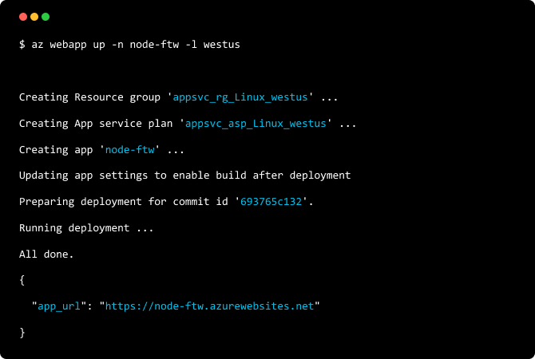

	

		<h1 style="text-align: center">Node.js Dev Center</h1> 
		
Build, deploy, and scale your Node.js applications on the Azure cloud.

		<ul class="cardsM cols cols2">
			<li style="
					flex-basis: 180px;
					text-align: center;
					background-color: black;
					font: white;
					display: block;
					margin-left: auto;
					margin-top: 15px;
					margin-bottom: 25px;
					margin-right: 10px;

				">
				<a class="card" href="https://azure.microsoft.com/en-us/try/app-service/web/?language=nodejs">
					 
						

						<h3 style="
							color: white;
							font-size: large;
						">Get started free &gt;</h3>
					

				</a>
			</li>

			<li style="
					flex-basis: 180px;
					text-align: center;
					background-color: white;
					display: block;
					margin-right: auto;
					margin-top: 15px;
					margin-bottom: 25px;
					margin-left: 10px;
				">
				<a class="card" href="https://code.visualstudio.com/docs/nodejs/nodejs-deployment">
					 
						

						<h3 style="
							color: black;
							font-size: large;
						">Documentation</h3>
					

				</a>
			</li>
		</ul>
		

		<h2 style="margin-top: 50px">Get started fast</h2>
		<ul class="cardsM cols cols3">
			<li>
				<a class="card" href="https://code.visualstudio.com/tutorials/static-website/getting-started">
					
					

						<h3>Static site hosting</h3>
						
Host your SPA with Azure Storage

					

				</a>
			</li>
			<li>
				<a class="card" href="https://code.visualstudio.com/tutorials/app-service-extension/getting-started">
					
					

						<h3>Full stack hosting</h3>
						
Deploy Express apps with App Service

					

				</a>
			</li>
			<li>
				<a class="card" href="https://code.visualstudio.com/tutorials/docker-extension/getting-started">
					
					

						<h3>Container app hosting</h3>
						
Build and deploy Node microservices on Azure

					

				</a>
			</li>
			<li>
				<a class="card" href="https://code.visualstudio.com/tutorials/functions-extension/getting-started">
					
					

						<h3>Serverless apps and APIs</h3>
						
Use Azure functions to go serverless

					

				</a>
			</li>
			<li>
				<a class="card" href="https://docs.microsoft.com/en-us/azure/iot-hub/iot-hub-node-node-getstarted">
					
					

						<h3>Connect and manage IoT devices</h3>
						
Use Azure IoT Hub to manage thousands of devices

					

				</a>
			</li>
			<li>
				<a class="card" href="https://docs.microsoft.com/en-us/vsts/build-release/apps/cd/azure/azure-devops-project-nodejs?toc=%2Fvsts%2Fdeploy-azure%2Ftoc.json&bc=%2Fvsts%2Fdeploy-azure%2Fbreadcrumb%2Ftoc.json&view=vsts">
					
					

						<h3>Add CI/CD</h3>
						
Use CI/CD to automate your deployments

					

				</a>
			</li>
		</ul>

		

		<h2 style="text-align: left;">npm modules for every job</h2>
		
		<ul class="pivots">
			<li>
				<a href="#storage">Upload files to storage</a>
				<ul id="storage">
					<li>
						
						

							

								<h3>Upload files to Azure Storage </h3>
								<h4>1. Download the Azure CLI (on Windows <a href="https://docs.microsoft.com/en-us/cli/azure/install-azure-cli?view=azure-cli-latest"> get the MSI</a>) and login.</h4> 
								
bash
								

								<pre><code class="lang-bash">
brew install azure-cli
az login 
az group create --name MyResourceGroup --location &quot;West US&quot;
								</code></pre>
			
								<h4>2. Create a storage container.</h4> 
								
bash
								

								<pre><code class="lang-bash">
az storage account create -n mystorageaccount12312 -g MyResourceGroup -l westus --sku Standard_LRS
az storage account keys list -n mystorageaccount12312 -g MyResourceGroup --output table
az storage container create --name my-container --public-access blob --account-name mystorageaccount12312 --account-key &lt;account-key-from-step-4&gt;
								</code></pre>
			
								<h4>3. Upload files using the Azure storage npm package.</h4> 
								

									<!-- <ul role="tablist">
										<li role="presentation">
										<a href="#tabpanel_ErXr5hkbUU_javascript" role="tab" aria-controls="tabpanel_ErXr5hkbUU_javascript" data-tab="javascript" tabindex="0" aria-selected="true" data-bi-name="tab">JavaScript</a>
										</li>
										<li role="presentation">
											<a href="#tabpanel_ErXr5hkbUU_typescript" role="tab" aria-controls="tabpanel_ErXr5hkbUU_typescript" data-tab="typescript" tabindex="-1" data-bi-name="tab" aria-selected="false">TypeScript</a>
										</li>
									</ul> -->
									<section id="tabpanel_ErXr5hkbUU_javascript" role="tabpanel" data-tab="javascript">
										
JavaScript
										

										<pre><code class="lang-js">
let storage = require('azure-storage');
let util = require('util');

async function main() {
	const containerName = "my-container"; 
	const blobService = storage.createBlobService("mystorageaccount1231", ACCOUNT_KEY); 

	blobService.createBlockBlobFromLocalFile = util.promisify(blobService.createBlockBlobFromLocalFile); 
	blobService.listBlobsSegmented = util.promisify(blobService.listBlobsSegmented); 

	const uploadResult = await blobService.createBlockBlobFromLocalFile(containerName, "myFile.txt", "&lt;FULL_FILE_PATH&gt;"); 
	const listResult = await blobService.listBlobsSegmented(containerName, null);
}
main();                                 
										</code></pre>
									</section>
									<section id="tabpanel_ErXr5hkbUU_typescript" role="tabpanel" data-tab="typescript" hidden="hidden" aria-hidden="true">
										

											TypeScript
											

											<pre><code class="lang-TypeScript">
import { promisify } from 'bluebird';
import { createBlobService, BlobService, common } from 'azure-storage';

async function main() {
	const containerName = "my-container"; 
	const blobService = createBlobService("mystorageaccount1231", ACCOUNT_KEY); 

	const createBlockBlobFromLocalFileAsync = promisify(blobService.createBlockBlobFromLocalFile, {context: blobService});
	const listBlobsSegmentedAsync = promisify(blobService.listBlobsSegmented, {context: blobService});

	const uploadResult = await createBlockBlobFromLocalFileAsync(containerName, "myFile.txt", "&lt;FULL_FILE_PATH&gt;");
	const listResult = await listBlobsSegmentedAsync(containerName, null);
}
main();                             
											</code></pre>
									</section>
								

							

						

					</li>
				</ul>	
			</li>

			<li>
				<a href="#cogs">Sentiment analysis</a>
				<ul id="cogs">
					<li>
						<a href="#cogs1">Text Analytics</a>
						

							

								<h3>Get sentiment on any language. </h3>
								<h4>1. Download the Azure CLI (on Windows <a href="https://docs.microsoft.com/en-us/cli/azure/install-azure-cli?view=azure-cli-latest"> get the MSI</a>) and login.</h4> 
								
bash
								

								<pre><code class="lang-bash">
brew install azure-cli
az login 
az group create --name MyResourceGroup --location &quot;West US&quot;
								</code></pre>
			
								<h4>2. Create a cognitive services text analytics account and retrieve your account key.</h4> 
								
bash
								

								<pre><code class="lang-bash">
az cognitiveservices account create -n cogstest -g MyResourceGroup --sku S0 --kind TextAnalytics -l westcentralus
az cognitiveservices account keys list -g MyResourceGroup -n cogstest
								</code></pre>
			
								<h4>3. Use the cognitive services API using your account key.</h4> 
								

									<!-- <ul role="tablist">
										<li role="presentation">
											<a href="#tabpanel_ErXr5hkbUU_javascript" role="tab" aria-controls="tabpanel_ErXr5hkbUU_javascript" data-tab="javascript" tabindex="0" aria-selected="true" data-bi-name="tab">JavaScript</a>
										</li>
										<li role="presentation">
											<a href="#tabpanel_ErXr5hkbUU_typescript" role="tab" aria-controls="tabpanel_ErXr5hkbUU_typescript" data-tab="typescript" tabindex="-1" data-bi-name="tab" aria-selected="false">TypeScript</a>
										</li>
									</ul> -->
									<section id="tabpanel_ErXr5hkbUU_javascript" role="tabpanel" data-tab="javascript">
										
JavaScript
										

										<pre><code class="lang-js">
let https = require("https");

let request_params = {
	method: "POST",
	hostname: "westcentralus.api.cognitive.microsoft.com",
	path: "/text/analytics/v2.0/sentiment",
	headers: {
		"Ocp-Apim-Subscription-Key": ACCOUNT_KEY,
	}
};

let getTextAnalytics = https.request(request_params, function (response) {
	let body = "";
	response.on("data", function (d) {
		body += d;
	});
	response.on("end", function () {
		let body_ = JSON.parse(body);
		let body__ = JSON.stringify(body_, null, "  ");
		console.log(body__);
	});
	response.on("error", function (e) {
		console.log("Error: " + e.message);
	});
});

let body = JSON.stringify({
	"documents": [
		{ "id": "1", "language": "en", "text": "Node.js and Azure are awesome!" },
		{ "id": "2", "language": "es", "text": "Este ha sido un dia terrible." },
	]
});

getTextAnalytics.write(body);
getTextAnalytics.end();          
										</code></pre>
									</section>
									<section id="tabpanel_ErXr5hkbUU_typescript" role="tabpanel" data-tab="typescript" hidden="hidden" aria-hidden="true">
										

											TypeScript
											

											<pre><code class="lang-TypeScript">
// TODO                             
											</code></pre>
									</section>
								

							

						

					</li>
				</ul>
			</li>
		</ul>				
		
		<ul class="cardsM cols cols2">
			<li style="
					flex-basis: 180px;
					text-align: center;
					background-color: black;
					font: white;
					display: block;
					margin-left: auto;
					margin-top: 15px;
					margin-bottom: 25px;
					margin-right: 10px;
	
				">
				<a class="card" href="https://azure.microsoft.com/en-us/try/app-service/web/?language=nodejs">
					 
						

						<h3 style="
							color: white;
							font-size: large;
						">Get started free &gt;</h3>
					

				</a>
			</li>
	
			<li style="
					flex-basis: 180px;
					text-align: center;
					background-color: white;
					display: block;
					margin-right: auto;
					margin-top: 15px;
					margin-bottom: 25px;
					margin-left: 10px;
				">
				<a class="card" href="https://docs.microsoft.com/en-us/javascript/api/overview/azure/?view=azure-node-latest">
					 
						

						<h3 style="
							color: black;
							font-size: large;
						">API Reference</h3>
					

				</a>
			</li>
		</ul>
	

