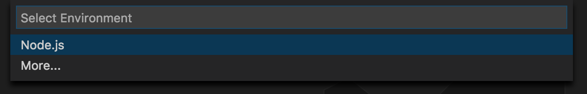
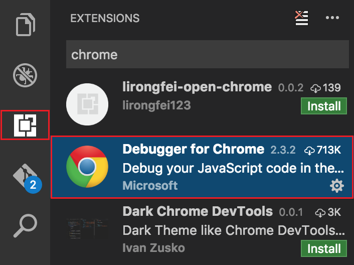
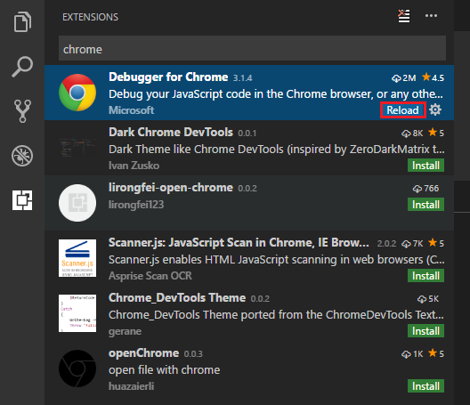
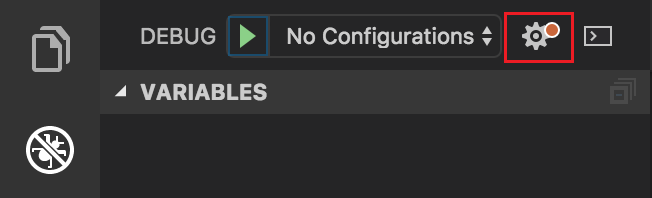
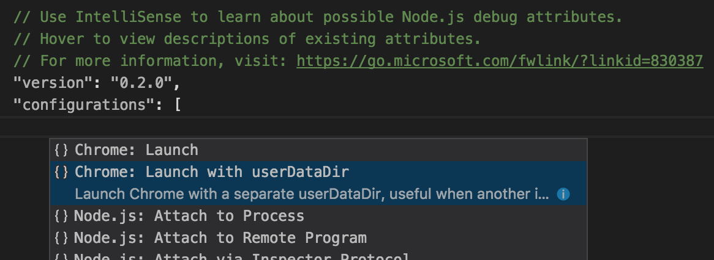
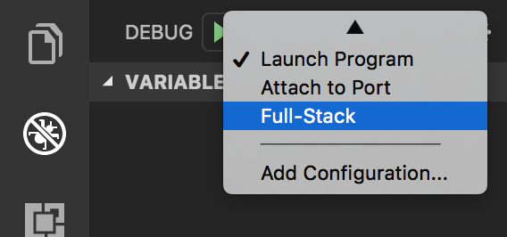
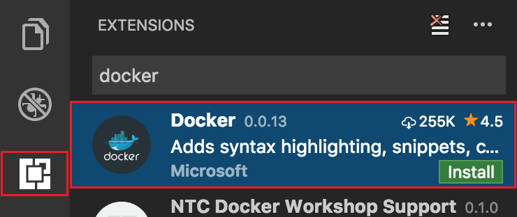

# Node.js development with Visual Studio Code and Azure

This tutorial illustrates taking an existing Node.js app, "containerizing" it (with Docker), and then deploying the app to the cloud.

The tutorial makes use of a simple todo app created by and published by [Scotch.io](https://scotch.io/tutorials/creating-a-single-page-todo-app-with-node-and-angular). It is a single-page MEAN app, and therefore, uses MongoDB as its database, Node/Express for the REST API/web server, and Angular.js 1.x for the front-end UI. 

## Prerequisites

In order to follow along with the demo, you'll need to have the following software installed:

- [Visual Studio Code Insiders Build](https://code.visualstudio.com/insiders) - The insider's build provides access to the latest bug fixes/feature enhancements (just like Chrome Canary builds), and is the same build that the Visual Studio Code team uses.
- [Docker](https://www.docker.com/products/docker)
- [DockerHub account] - You'll need to have a DockerHub account in order to publish the Docker images that will be created in this tutorial.
- [Azure CLI 2.0](https://docs.microsoft.com/cli/azure/install-az-cli2)
- [Azure account](https://azure.microsoft.com/free/)
- [Yarn](https://yarnpkg.com/en/docs/install)
- [Chrome](https://www.google.com/chrome/browser/desktop/) - Used for debugging the demo app's front-end.
- MongoDB - Since the demo app uses MongoDB, you need to have a locally running MongoDB instance that is listening on the standard `27017` port. The simplest way to achieve this is by running the following command after Docker is installed: `docker run -it -p 27017:27017 mongo`.

## Project setup

To get started, we need to download the sample project using the following steps:

1. Open Visual Studio Code.

1. Press **&lt;F1>** to display the command palette.

1. At the command palette prompt, enter `gitcl` to find the `Git: Clone` command and press **&lt;Enter>**.

	

1. When prompted for the **Repository URL**, enter `https://github.com/scotch-io/node-todo`, then press **&lt;Enter>**.

1. Select (or create) the local directory into which you want to clone the project.

	

## Integrated terminal

Since this is a Node.js project, the first thing you need to do is ensure that all of the project's dependencies are installed from npm.  

1. Press **&lt;Ctrl>`** to display the Visual Studio Code integrated terminal. 

1. Enter `yarn`, and press **&lt;Enter>**.  

	

## Integrated Git version control

After installing the app's dependencies via Yarn, a `yarn.lock` file is created that provides a predictable way to reacquire the exact same dependencies in the future, without any surprises in either CI (continuous integration) builds, production deployments, or other developer's machines.

The following steps illustrate how to check the `yarn.lock` file into source control:

1. Within Visual Studio Code, switch to the integrated Git tab (the tab with the Git logo).

1. In the **Message** box, enter a commit message, and press **&lt;Ctrl>&lt;Enter>**. 

	

## Project and code navigation

In order to orient ourselves within the codebase, let's play around with some examples of some of the navigation capabilities that Visual Studio Code provides.

1. Type **&lt;Ctrl>p**.

1. Enter `.js` to display all the JavaScript/JSON files in the project along with each file's parent directory 

    

1. Select `server.js`, which is the startup script for the app. 

1. Hover your mouse over the `database` variable (imported on line 6) to see its type. This ability to quickly inspect variables/modules/types within a file is very useful during the development of your projects. 

    

1. Clicking your mouse within the span of a variable - such as `database` - allows you to see all references to that variable within the same file. To view all references to a variable within the project, right-click the variable, and from the context menu, and select **Find All References**.

    

1. In addition to being to hover your mouse over a variable to discover its type, you can also inspect the definition of a variable, even if it's in another file. To see this in action, right-click `database.localUrl` (line 12), and, from the context menu, select **Peek Definition**. 

    

## Modifying the code and using autocompletion

The MongoDB connection string is hard-coded in declaration of the `database.localUrl`. In this section, you'll modify the code to retrieve the connection string from an environment variable, and learn about Visual Studio Code's autocompetion feature.  

1. Open the `server.js` file

1. Replace the following code: 

	```javascript
	mongoose.connect(database.localUrl);
	```

	with this code:

	```javascript
	mongoose.connect(process.env.MONGODB_URL || database.localUrl);
	```

Note that if you type the code in manually (instead of copy and paste), when you type the period after `process`, Visual Studio Code displays the available members of the Node.js `process` global API.


Autocompetion works because Visual Studio Code uses TypeScript behind the scenes - even for JavaScript - to provide type information that can then be used to inform the completion list as you type. Visual Studio Code is able to detect that this is a Node.js project, and as a result, automatically downloaded the TypeScript typings file for [Node.js from NPM](https://www.npmjs.com/package/@types/node). The typings file allows you to get autocompletion for other Node.js globals such as `Buffer` or `setTimeout`, as well as all of the built-in modules such as `fs` and `http`.

In addition to the built-in Node.js APIs, this auto-acquisition of typings also works for over 2,000 3rd party libraries, such as React, Underscore and Express. For example, in order to disable Mongoose from crashing the sample app if it can't connect to the configured MongoDB database instance, insert the following line of code at  line 13:

	```javascript
	mongoose.connection.on("error", () => { console.log("DB connection error"); });
	```

As with the previous code, you'll notice that you get autocompletion without any work on your part.


You can see which libraries support this auto-complete capability by browsing the [DefinitelyTyped](https://github.com/DefinitelyTyped/DefinitelyTyped) project, which is the community-driven source of all TypeScript type definitions.

## Running The app

Once you've explored the code a bit, it's time to run the app. To run the app from Visual Studio Code, press **&lt;<F5>**. When running the code via **&lt;<F5>** (debug mode), Visual Studio Code launches the app and displays the **Debug Console** window that displays stdout for the app.


Additionally, the **Debug Console** is attached to the newly running app so you can type JavaScript expressions, which will be evaluated in the app, and also includes auto-completion. To see this in action, type `process.env` in the console:


You were able to press **&lt;F5>** to run the app because the currently open file is a JavaScript file (`server.js`). As a result, Visual Studio Code assumes that the project is a Node.js app. If you close all JavaScript files in Visual Studio Code, and then press **&lt;F5>**, Visual Studio Code will query you as the environment:



Open a browser, and navigate to `http://localhost:8080` to see the running app. Type a message into the textbox and add/remove a few todos to get a feel for how the app works.


## Debugging

In addition to being able to run the app and interact with it via the integrated console, Visual Studio Code provides the ability to set breakpoints directly within your code. For example, hit **&lt;Ctrl>P** to display the file picker. Once the file picker displays, type `route`, and select the `route.js` file.

Set a breakpoint on line 28, which represents the Express route that is called when the app tries to add a todo entry. To set a breakpoint, simply click the area to the left of the line number within the editor as shown in the following figure.


> [!NOTE]
> In addition to standard breakpoints, Visual Studio Code supports conditional breakpoints that allow you to customize when the app should suspend execution. To set a conditional breakpoint, right-click the area to the left of the line on which you wish to pause execution, select **Add Conditional Breakpoint...**, and specify either a JavaScript expression (e.g. `foo = "bar"`) or execution count that defines the condition under which you want to pause execution.

Once the breakpoint has been set, return to the running app and add a todo entry. Adding a todo entry immediately causes the app to suspend execution on line 28 where you set the breakpoint:


Once the application has been paused, you can hover your mouse over the code's expressions to view their current value, inspect the locals/watches and call stack, and use the debug toolbar to step through the code execution. Press **&lt;F5>** to resume execution of the app.

## Full-stack debugging

As mentioned earlier in the topic, the TODO app is a MEAN app - meaning that its front-end and back-end are both written using JavaScript. So, while we're currently debugging the back-end (Node/Express) code, at some point, you may need to debug the front-end (Angular) code. For that purpose, Visual Studio Code has a huge ecosystem of extensions, including integrated Chrome debugging.

Switch to the **Extensions** tab, and type `chrome` into the search box:



Select the extension named **Debugger for Chrome**, and select **Install**. After installing the Chrome debugging extension, select **Reload** to close and reopen Visual Studio Code in order to activate the extension. 



While you were able to run and debug the Node.js code without any Visual Stdio Code-specific configuration, in order to debug a front-end web app, you need to generate a `launch.json` file that instructs Visual Studio Code how to run the app. 

To generate the `launch.json` file, switch to the **Debug** tab, click the gear icon (which should have a little red dot on top of it), and select the `node.js` environment.



Once created, the `launch.json` file looks similar to the following, and tells Visual Studio Code how to launch and/or attach to the app in order to debug it. 

```json
{
    "version": "0.2.0",
    "configurations": [
        {
            "type": "node",
            "request": "launch",
            "name": "Launch Program",
            "program": "${workspaceRoot}/server.js"
        },
        {
            "type": "node",
            "request": "attach",
            "name": "Attach to Port",
            "address": "localhost",
            "port": 5858
        }
    ]
}
```

Note that Visual Studio Code was able to detect that the app's startup script is `server.js`. 

With the `launch.json` file open, select **Add Configuration** (bottom right), and select **Chrome: Launch with userDataDir**.



Adding a new run configuration for Chrome allows you to debug the front-end JavaScript code. 

You can hover your mouse over any of the settings that are specified to view documentation about what the setting does. Additionally, notice that Visual Studio Code automatically detects the URL of the app. Update the **webRoot** property to `${workspaceRoot}/public` so that the Chrome debugger will know where to find the app's front-end assets:

```json
{
   "type": "chrome",
   "request": "launch",
   "name": "Launch Chrome",
   "url": "http://localhost:8080",
   "webRoot": "${workspaceRoot}/public",
   "userDataDir": "${workspaceRoot}/.vscode/chrome"
}
```

In order to launch/debug both the front and back-end at the same time, you need to create a *compound* run configuration that tells Visual Studio Code which set of configurations to run in parallel. 

Add the following snippet as a top-level property within the `launch.json` file (as a sibling of the existing `configurations` property).

```json
"compounds": [
   {
      "name": "Full-Stack",
      "configurations": ["Launch Program", "Launch Chrome"]
   }
]
```

The string values specified in the `compounds.configurations` array refer to the `name` of individual entries in the list of `configurations`. If you've modfied those names, you'll need to make the appropriate changes in the array. To see this in action, switch to the debug tab, and change the selected configuration to `Full-Stack` (the name of the compound configuration), and press **&lt;F5>** to run it.



Running the configuration launches the Node.js app (as can be seen in the debug console output) and Chrome (configured to navigate to the Node.js app at `http://localhost:8080`).

Press **&lt;Ctrl>P**, and enter (or select) `todos.js`, which is the main Angular controller for the app's front-end. 

Set a breakpoint on line 11, which is the entry-point for a new todo entry being created.

Return to the running app, add a new todo entry, and notice that Visual Studio Code has now suspended execution within the Angular code.


Like Node.js debugging, you can hover your mouse over expressions, view locals/watches, evaluate expressions in the console, and so on. 

There are two cools things to note:

1. The `Call Stack` pane displays two different stacks: `Node` and `Chrome`, and indicates which one is currently paused.

1. You can step between front and back-end code. To test this, press **&lt;F5>**, which will run and hit the breakpoint previously set in the Express route.

With this setup, you can now efficiently debug front, back, or full-stack JavaScript code directly within Visual Studio Code. 

In addition, the compound debugger concept is not limited to just two target processes, and also isn't just limited to JavaScript. Therefore, if work on a microservice app (that is potentially polyglot), you can use the exact same workflow (once you've installed the appropriate extensions for the language/framework).

## Dockerizing the app

This section focuses on the experience that Visual Studio Code provides for developing with [Docker](https://www.docker.com/). Node.js developers use Docker to provide portable app deployments for both development, CI (continuous integration), and production environments. As Docker presents a steep-learning curve to some, Visual Studio Code provides an extension that tries to help simplify some using Docker in your apps.

Switch back to the **Extensions** tab, search for `docker`, and select the `Docker` extension. 

Install the Docker extension, and then reload Visual Studio Code.



The Docker extension for Visual Studio Code includes a command for generating a *Dockerfile* and the `docker-compose.yml` file for an existing project. 

To see the available Docker commands, display the commnand palette (**&lt;F1>**), and type `docker`.


Select **Docker: Add docker files to workspace**, select **Node.js** as the app platform, and specify that the app exposes port `8080`. 

The Docker command generates a complete `Dockerfile` and Docker-compose files that you can begin using immediately.


The Docker extension also provides auto-completion for your `Dockerfiles` and `docker-compose.yml` files, which makes authoring your Docker assets a lot simpler. For example, open up the `Dockerfile` and change line 2 from:

```docker
FROM node:latest
```

To:

```docker
FROM mhart
```

With your cursor after the `t` in `mhart`, hit `CTRL+Space` to view all of the image repositories that `mhart` has published on DockerHub.


Select `mhart/alpine-node`, which a very efficient and small Linux distro and provides everything that this app needs, without any additional bloat (Alpine Linux is great for Docker!). Smaller images are typically better since you want your app builds and deployments to be as fast as possible, which makes distribution/scaling/etc. quick.

Now that we have our `Dockerfile`, we need to build the actual Docker image. Once again, we can use a command that the Docker extension installed, by typing `F1` and entering `dockerb` (using "fuzzy search"). Select the `Docker: Build Image` command, choose the `/Dockerfile` that we just generated/edited, and then give a tag to the image which includes your DockerHub username (e.g. `lostintangent/node`). Hit `<ENTER>`, which will launch the integrated terminal window and display the output of your Docker image being built.


Notice that the command simply automated the process of running `docker build` for you, which is another example of a productivity enhancer that you can either choose to use, or you can just use the Docker CLI directly. Whatever works best for you!

At this point, to make this image easily acquirable for deployments, we just need to push it to DockerHub. To do this, make sure you have already autheticated with DockerHub by running `docker login` from the CLI and entering your account credentials. Then, back in VS Code, you can bring up the command palette, enter `dockerpush` and select the `Docker: Push` command. Select the image tag that you just build (e.g. `lostintangent/node`) and hit `<ENTER>`. This will automate calling `docker push` and will display the output in the integrated terminal.

> We plan to add support for logging in to container registries from the Docker extension for VS Code (e.g. via a `Docker: Login` command), with the goal of further simplifying the above experience.

## Deploying Your App

Now that we have our app Dockerized and pushed to DockerHub, we need to actually deploy it to the cloud so we can show it off to the world. For this, we'll use Azure App Service, which is Azure's PaaS offering, and recently added two new capabilities which are relevant to Node.js developers:

1. Support for Linux-based VMs, which reduces incompatibilities for apps which are built using native Node modules, or other tools which might not support Windows and/or may behave differently.

2. Support for Docker-based deployments, which allow you to simply specify the name of your Docker image, and allow App Service to pull, deploy and scale the image automatically.

To get started, open up your terminal, and we'll use the new Azure CLI 2.0 to manage your Azure account and provision the necessary infrastructure to run the todo app. Once you've logged into your account from the CLI using the `az login` command (as mentioned in the pre-reqs), perform the following steps in order to provision the App Service instance and deploy the todo app container:

1. Create a resource group, which you can think of as a "namespace" or "directory" for helping to organize Azure resources. The `-n` flag is the name of the group and can be specified as anything you want.

    ```shell
    az group create -n nina-demo -l westus
    ```

    *Note: The `-l` flag indicates the location of the resource group. While in preview, the App Service on Linux support is only available in select regions, so if you aren't located in the Western US, and you want to check which other regions are available, simply run `az appservice list-locations --linux-workers-enabled` from the CLI to view your datacenter options.*

2. Set the newly created resource group as the default one, so that you can continue to use the CLI without needing to explicitly specify it:

   ```shell
   az configure -d group=nina-demo
   ```
   
3. Create the App Service "plan", which will manage creating and scaling the underlying VMs that your app is deployed to. Once again, specify any value that you'd like for the name flag.

    ```shell
    az appservice plan create -n nina-demo-plan --is-linux
    ```

    > Note: The --is-linux flag is key, since that is what indicates that you want Linux-based VMs. Without it, the CLI will provision Windows-based VMs.

4. Create the App Service web app, which represents the actual todo app that will be running within the plan and resource group we just created. You can roughly think of a web app as being synonymous with a process or container, and the plan as being the VM/container host that they're running on. Additionally, as part of creating the web app, we'll configure it to use the Docker image that we just published to DockerHub:

    ```shell
    az webapp create -n nina-demo-app -p nina-demo-plan -i lostintangent/node
    ``` 
    
    > Note: If instead of using a custom container, you'd prefer to do Git deployment, check out the instructions for setting that up [here](https://docs.microsoft.com/en-us/azure/app-service-web/app-service-web-get-started-nodejs#configure-to-use-nodejs).

5. Set the newly created web app as the default web instance, so that you can continue to use the CLI without needing to explicitly specify it:

    ```shell
    az configure -d web=nina-demo-app
    ```

6. Launch the app to view the container that was just deployed, which will be available at an `*.azurewebsites.net` URL:

    ```shell
    az webapp browse
    ```

    

    > Note: This may take a minute to first load your app, since App Service has to pull your Docker image from DockerHub and then start it up.

Yay! We just deployed our app. However, the spinning icon indicates that the app can't connect to the database, which makes sense because we were using a local instance of MongoDB during development, which obviously isn't reachable from within the Azure datacenters. Fortunately, since we updated the app to accept the connection string via an environment variable, we just need to spin up a MongoDB server and re-configure the App Service instance to reference it.

## Provisioning a MongoDB Server

While we could setup a MongoDB server, or replica set, and manage that infrastructure ourselves, Azure provides another solution called [Cosmos DB](https://azure.microsoft.com/en-us/services/documentdb/). Cosmos DB is a fully-managed, geo-replicable, high-performance, NoSQL database, which provides a MongoDB-compatibility layer. This means that you can point an existing MEAN app at it (or any MongoDB client/tool such as [Studio 3T](https://studio3t.com/)), without needing to change anything but the connection string! Let's take a look at how this works:

1. Head back to your terminal, and run the following command in order to create a MongoDB-compatible instance of the Cosmos DB service. Feel free to name the instance whatever you'd like, by taking note to replace the `<NAME>` placeholder below with a globally unique value (Cosmos DB uses this name to generate the database's server URL):

   ```shell
   COSMOSDB_NAME=<NAME>
   az cosmosdb create -n $COSMOSDB_NAME --kind MongoDB
   ```

2. Retrieve the MongoDB connection string for this instance by running the following command:

   ```shell
   MONGODB_URL=$(az cosmosdb list-connection-strings -n $COSMOSDB_NAME -otsv --query "connectionStrings[0].connectionString")
   ```

3. Update your web app's `MONGODB_URL` environment variable, so that it connects to the newly provisioned Cosmos DB instance, instead of attempting to connect to a locally running MongoDB server (which doesn't exist!):

    ```shell
    az webapp config appsettings set --settings MONGODB_URL=$MONGODB_URL
    ```

4. Return to your browser and refresh it. Try adding and removing a todo item, to prove that the app now works without needing to change anything! We simply set the environment variable to our created Cosmos DB instance, which is fully emulating a MongoDB database.

    

When needed, we could switch back to the Cosmos DB instance, and scale up (or down) the reserved throughput that our MongoDB instance needs, and benefit from the added traffic without needing to manage any infrastructure manually.

Additionally, Cosmos DB automatically indexes every single document and property for you, so you don't need to worry about  profiling slow queries and/or manually fine-tuning your indexes. Just provision and scale as needed, and let Cosmos DB handle the rest!

## Hosting a Private Docker Registry

DockerHub provides an amazing experience for distributing your container images, but there may be scenarios where you'd prefer to host your own private Docker registry, for security/governance and/or performance benefits. Azure provides the [Azure Container Registry](https://azure.microsoft.com/en-us/services/container-registry/) (ACR), which allows you to spin up your own Docker registry, whose backing storage is located in the same data center as your web app (which makes pulls quicker!), and provides you with full control over its contents and access controls (e.g. who can push and/or pull images?). Provisioning a custom registry is as simple as running the following command, taking note to replace the `<NAME>` placeholder with a globally unique value (ACR uses this to generate the registry's login server URL):

```shell
ACR_NAME=<NAME>
az acr create -n $ACR_NAME -l westus --admin-enabled
```

> The "admin account" isn't the recommended authentication solution for production registries, however, for the sake of experimentation and simplicity, we're going with that. The output of creating your ACR instance will actually instruct you on how to create a "service principal" in Azure Active Directory, so feel free to go off the happy path using that guidance.

After running this, it will display the login server URL (via the `LOGIN SERVER` column) which you'll use to login to it using the Docker CLI (e.g. `ninademo.azurecr.io`). Additionally, it generated admin credentials that you can use in order to authenticate against it. To retrieve these credentials, run the following command and grab the displayed username and password:

```shell
az acr credential show -n $ACR_NAME
```

Using these credentials, and your individual login server, you can login to the registry using the standard Docker CLI workflow:

```shell
docker login <LOGIN_SERVER> -u <USERNAME> -p <PASSWORD>
```

You can now tag your Docker container to indicate that it's associated with your private registry, using the following command (replacing `lostintangent/node` with whatever name you gave to the container image previously):

```shell
docker tag lostintangent/node <LOGIN_SERVER>/lostintangent/node
```

Finally, you can push this newly-tagged image to your private Docker registry:

```shell
docker push <LOGIN_SERVER>/lostintangent/node
```

> Alternatively, you could use the `Docker: Tag Image` and `Docker: Push` commands via the VS Code command pallette, so just go with your preferred workflow. I chose to use the CLI for these steps since we were already in the terminal.

Your container is now stored in your own private registry, and the Docker CLI was happy to allow you to continue working in the same way as you did when using DockerHub. In order to instruct the App Service web app to pull from your private registry, you simply need to run the following command:

```shell
az appservice web config container set \
    -r <LOGIN_SERVER> \
    -c <LOGIN_SERVER>/lostintangent/node \
    -u <USERNAME> \
    -p <PASSWORD> 
```

> Make sure to add the `https://` prefix to the beginning of the `-r` parameter, as App Service currently expects it. However, don't add this to the container image name.

If you refresh the app in your browser, everything should look and work the same, however, it's now running your app via your private Docker registry! Once you update your app, simply tag and push the changes as done above, and update the tag in your App Service container configuration.

## Configuring a custom domain name

While the `*.azurewebsites.net` URL is cool for testing, at some point, you'll likely want to add a custom domain name to your web app. Once you've already purchased your domain from a registrar, you simply need to add an `A` record to it, that points at your web app's external IP (which is actually a load balancer). You can retrieve this IP by running the following command:

```shell
az webapp config hostname get-external-ip
```

In addition to add an `A` record, you also need to add a `TXT` record to your domain, that points at the `*.azurewebsites.net` domain we've been using thus far. These two records are what allows Azure to verify that you actually own the domain.

Once those records are created, and you've waited a litte while for the DNS changes to propagate (~1 hour), register the custom domain with Azure,so that it knows to expect the incoming traffic correctly. You can do this by simply running the following command:

```shell
az webapp config hostname add --hostname <DOMAIN>
```

> Note: If the DNS changes haven't propagated yet, the above command will fail. Simply wait a little while and re-run it later.

Now, once you navigate to your custom domain in a browser, you'll notice that it resolves to your deployed app on Azure!

## Scaling up and out

At some point, your web app may become popular enough that its allocated resources (CPU and RAM) aren't sufficient for handling the increase in traffic/operational demands. The App Service Plan that we created above (`B1`) comes with 1 CPU core and 1.75 GB of RAM, which as you can imagine, can get maxed out fairly quickly. The `B2` plan comes with twice as much RAM and CPU, so if you notice that your app is beginning to run out of either, you could "scale up" the underlying VM by running the following command:

```shell
az appservice plan update -n nina-demo-plan --sku B2
```

> Note: Check out [this page](nina-demo-plan) to view the pricing details and specs of each App Service Plan SKU.

After just a few moments, your web app will be migrated to the requested hardware, and can begin taking advantage of the associated resources. In addition to scaling up, you can also scale down by running the same command as above, but specifying a `--sku` that provides less resources, at a lower price. This way, you can ensure that your app has exactly what it needs. Nothing more and nothing less (depending on how much "buffer" you want to allocate).

In addition to scaling the VM specs up, as long as your web app is stateless, you also have the option to "scale out", by adding more underlying VM instances. The App Service Plan that we created above only included a single VM (a "worker"), and therefore, all incoming traffic is ultimately bound by the limits of the available resources of that one instance. If we wanted to add a second VM instance, we could run the same command as above, but instead of scaling up the SKU, we can scale out the number of worker VMs:

```shell
az appservice plan update -n nina-demo-plan --number-of-workers 2
```

When you scale a web app out like this, incoming traffic will be transparently load balanced between all instances, which allows you to immediately increase your capacity, without having to make any code changes, or worry about the needed infrastructure. This scaling simplicity is why stateless web apps are considered a best practice, since it makes the ability to scale them up, down, out, etc. entirely deterministic, since no single VM/app instance includes state that is neccessary in order to function. If you push all of your app's state (and associated complexity!) into PaaS database, and allow someone else to manage it for you (e.g. Cosmos DB, managed Redis), you'll likely be much happier in the long run!

> Note: While this tutorial only illustrates running a single web app as part of an App Service Plan, you can actually create and deploy multiple web apps into the same plan. This allows you to provision/pay for a single plan (which is ultimately a cluster of homogenous VMs, determine by the plan's SKU/worker count), and make the most use of them. 

## Clean-up

To ensure that you don't get charged for any Azure resources you aren't using, simply run the following command from your terminal to delete all of the resources we just provisioned:

```shell
az group delete
```

This will take a few minutes to complete, but when done, will leave your Azure account in the same state as it was before we started. This ability to organize, deploy and delete Azure resources as a single unit is one of the primary benefits of resource groups in the first place, so in the future, if you use Azure, I would recommend grouping resources together that you'd expect to have the same lifetime.

## Conclusion

Hopefully this demo illustrated some of the ways that Visual Studio Code and Azure are trying to help improve the overall Node.js development experience. Between debugging that supports full-stack and microservices, a rich authoring experience that provides navigation and auto-completion without any further configuration, and a large ecosystem of extensions such as Docker, that can enhance your feedback loop for other app types and practices, we're excited to keep evolving what productivity can look like from within a lightweight editor.

Additionally, between the Azure CLI, App Service and Cosmos DB, we're trying to provide a productive and low-management cloud stack for Node.js/MEAN apps that can scale as needed, without introducing additional infrastructure complexity.

Additionally, we hope to use this demo to continue iterating on the overall Node.js experience in both VS Code and Azure, so we can make it simpler and more flexible. If you have any questions or feedback for how we can improve things, please don't hesitate to file an issue on this repo or send me an [e-mail](mailto:joncart@microsoft.com). 